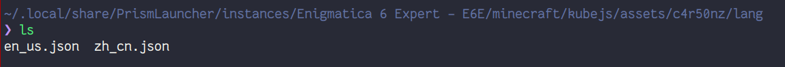

### 整合包信息

当前: Enigmatica 6 Expert (E6E)

版本: 1.8.0

- [curseforge](https://www.curseforge.com/minecraft/modpacks/enigmatica6expert)
- [mcmod](https://www.mcmod.cn/modpack/399.html)

### 额外mod(必看)

#### The Toolkits

除原版整合包外需要加一个额外的mod: The Toolkits，添加了一些辅助功能。详情可看
- [mcmod](https://www.mcmod.cn/class/10336.html)
- [curseforge](https://legacy.curseforge.com/minecraft/mc-mods/the-toolkits)
- [modrinth](https://modrinth.com/mod/the-toolkits)

### ftbquests汉化相关(必看)

因为要让ftbquests支持多语言，修改了服务器的`config/ftbquests/quests`目录，客户端需
要将相应的语言文件加到客户端里。

- 需要任务文本为英文，下载[en\_us.json](e6e/en_us.json)
- 需要任务文本为中文，下载[en\_us.json](e6e/en_us.json)和[zh\_cn.json](e6e/zh_cn.json)

下载后将json文件放置到`/path/to/minecraft/kubejs/assets/<name>/lang`目录中，重启游戏即可。

`<name>`可以是任意合法名，不要覆盖现有的，新建`/<name>/lang`目录。
示例：

这个改动只影响服务器，单机不会有影响。

服务端的改动可以参考脚本: [extract.py](e6e/extract.py)
